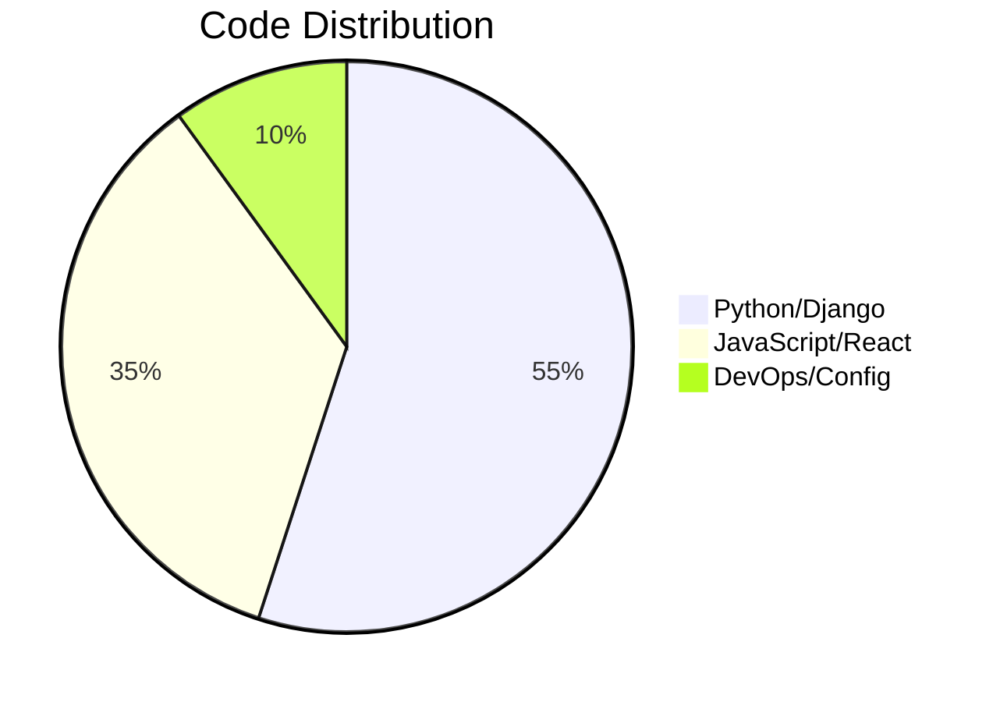

```ascii
╔══════════════════════════════════════════════════════════════════════════════╗
║                                                                              ║
║     ██╗   ██╗██╗███╗   ██╗ █████╗ ██╗   ██╗ █████╗  ██████╗  █████╗ ███╗   ███╗     ║
║     ██║   ██║██║████╗  ██║██╔══██╗╚██╗ ██╔╝██╔══██╗██╔════╝ ██╔══██╗████╗ ████║     ║
║     ██║   ██║██║██╔██╗ ██║███████║ ╚████╔╝ ███████║██║  ███╗███████║██╔████╔██║     ║
║     ╚██╗ ██╔╝██║██║╚██╗██║██╔══██║  ╚██╔╝  ██╔══██║██║   ██║██╔══██║██║╚██╔╝██║     ║
║      ╚████╔╝ ██║██║ ╚████║██║  ██║   ██║   ██║  ██║╚██████╔╝██║  ██║██║ ╚═╝ ██║     ║
║       ╚═══╝  ╚═╝╚═╝  ╚═══╝╚═╝  ╚═╝   ╚═╝   ╚═╝  ╚═╝ ╚═════╝ ╚═╝  ╚═╝╚═╝     ╚═╝     ║
║                                                                              ║
║            Backend Architect  •  Cloud Engineer  •  Automation Wizard       ║
║                                                                              ║
╚══════════════════════════════════════════════════════════════════════════════╝
```

<div align="center">

[](https://vinay-engineer.me/)
[](mailto:vinayagam.python@gmail.com)
[](https://linkedin.com/in/vk4499)

</div>

---

## 🎯 CURRENT MISSION

```python
class Vinayagam:
    def __init__(self):
        self.role = "Python Django Developer"
        self.company = "Thaagam Foundation"
        self.experience = "2+ years"
        self.location = "Kanchipuram, Tamil Nadu, IN"
        self.mission = "Building systems that scale, optimize, and inspire"
        
    def daily_routine(self):
        return [
            "☕ Coffee & Code Review",
            "🏗️  Architecting scalable Django backends",
            "☁️  Deploying to AWS with zero-downtime",
            "🔄 Automating everything that can be automated",
            "📊 Optimizing database queries like a boss"
        ]
    
    def currently_mastering(self):
        return {
            "cloud": ["AWS Advanced Services", "Kubernetes"],
            "architecture": ["System Design", "Microservices"],
            "performance": ["Query Optimization", "Caching Strategies"]
        }
```

---

## 🚀 TECH ARSENAL

<table>
<tr>
<td width="50%" valign="top">

### 🎨 Frontend Craft
```javascript
const frontend = {
  core: ['JavaScript', 'React', 'Redux'],
  styling: ['TailwindCSS', 'CSS3', 'Responsive Design'],
  tools: ['Webpack', 'Vite', 'npm/yarn'],
  approach: 'Component-driven, performance-first'
};
```

</td>
<td width="50%" valign="top">

### ⚙️ Backend Power
```python
backend = {
    "core": ["Python", "Django", "DRF"],
    "async": ["Celery", "Redis", "WebSockets"],
    "api": ["REST", "GraphQL"],
    "philosophy": "Clean, testable, scalable"
}
```

</td>
</tr>
<tr>
<td width="50%" valign="top">

### 🗄️ Data Layer
```sql
-- Database Expertise
SELECT skill FROM expertise
WHERE category = 'databases'
ORDER BY proficiency DESC;

┌──────────────┬──────────────┐
│ PostgreSQL   │ ████████████ │
│ Redis        │ ██████████   │
│ MongoDB      │ ████████     │
└──────────────┴──────────────┘
```

</td>
<td width="50%" valign="top">

### ☁️ Cloud & DevOps
```yaml
infrastructure:
  cloud: [AWS EC2, S3, RDS, Lambda]
  containers: [Docker, Docker Compose]
  ci_cd: [GitHub Actions, Automated Deployments]
  monitoring: [CloudWatch, Custom Logging]
  web_server: [Nginx, Gunicorn]
```

</td>
</tr>
</table>

---

## 💼 PRODUCTION DEPLOYMENTS

<div align="center">

| Project | Tech Stack | Impact | Status |
|---------|-----------|--------|--------|
| **[WASync](https://wasync.m7corporation.com)** | Django • PostgreSQL • WebSocket • AWS | WhatsApp automation platform serving multiple clients | 🟢 LIVE |
| **[Thaagam.org](https://thaagam.org)** | Django • React • PostgreSQL • AWS | NGO platform managing donations & events | 🟢 LIVE |
| **[GCC Services](https://imageanalysis.gccservices.in)** | Django • ML Integration • AWS | Image analysis & document processing system | 🟢 LIVE |

</div>

---

## 📈 GITHUB METRICS

<div align="center">


</div>

<div align="center">



</div>

---

## 🏆 ACHIEVEMENT UNLOCKED

<div align="center">

[](https://github.com/vinaythaagam)

</div>

---

## 🌊 CONTRIBUTION FLOW

<div align="center">

[](https://github.com/vinaythaagam)

</div>

---

## 💭 PHILOSOPHY

> **"Code is poetry written for machines, but read by humans."**  
> *— Vinayagam*

<div align="center">

```ascii
   _____ _                 _       
  / ____| |               | |      
 | (___ | |__   __ _ _ __ | | ___  
  \___ \| '_ \ / _` | '_ \| |/ _ \ 
  ____) | | | | (_| | |_) | |  __/ 
 |_____/|_| |_|\__,_| .__/|_|\___| 
                    | |            
                    |_|            
  Code • Deploy • Optimize • Repeat
```

</div>

---

## 📡 CONNECT & COLLABORATE

<div align="center">

[](https://linkedin.com/in/vk4499)
[](https://x.com/westcheyyur)
[](https://instagram.com/_vinay__jr)
[](https://github.com/vinaythaagam)


---

**💡 Open to:** Freelance Projects • Collaboration • Tech Discussions • Code Reviews

**📬 Best way to reach me:** [vinayagam.python@gmail.com](mailto:vinayagam.python@gmail.com)

---

<sub>Built with 💻 and ☕ by Vinayagam</sub>

</div>
